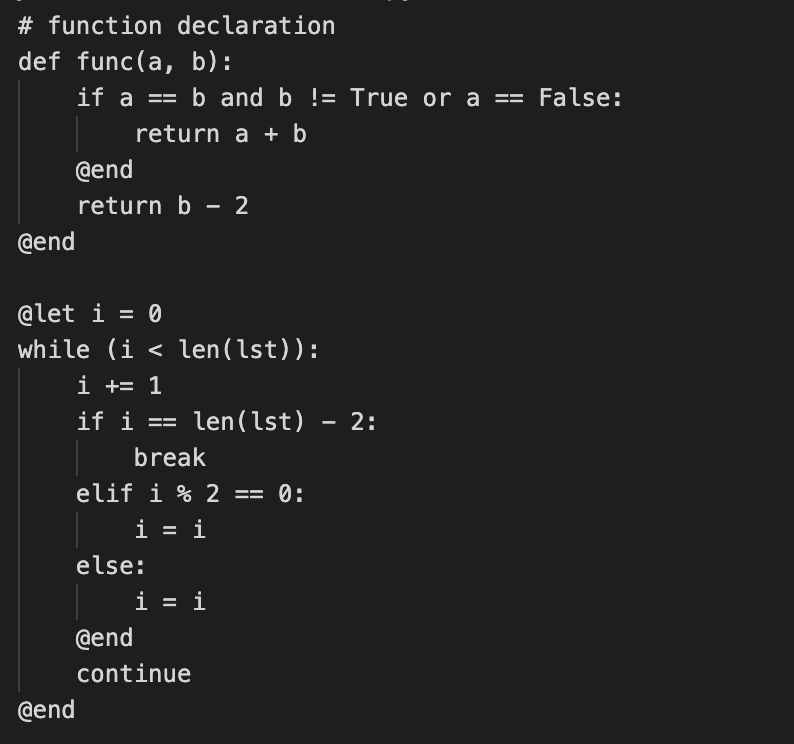
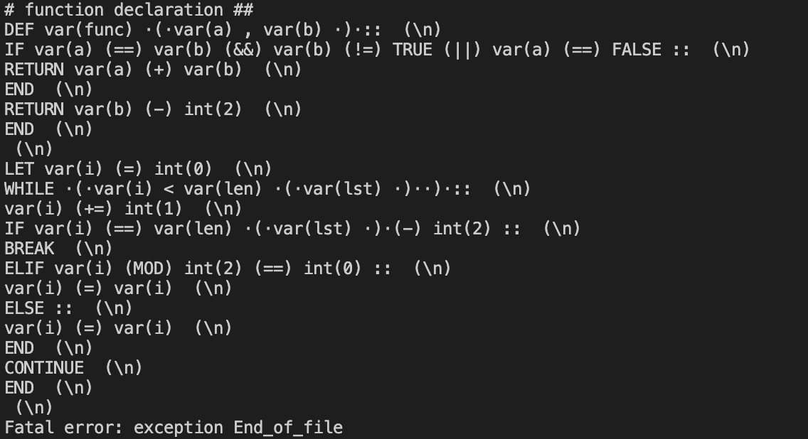

**Our project’s goal is to create a transpiler from a Python-like language to React JSX.**\
There are a few reasons why pure Python wasn’t chosen:
- Variables in Python do not have any identifiers to indicate this is the first time the variable is being declared unlike in Javascript which uses `let`, `const`, and `var`. The modified language requires `@let` and `@const` before first time variable declarations. While it is possible to have a list tracking variable names, determining whether to use let or const would make translation more complicated. 
- Whitespace and tab indentation determines scope in Python whereas JSX uses curly braces. We could find no other way but to require `@end` to signify the end of an if statement or loop or function declaration.

The first step was determining what syntax to support. It seemed obvious at first but there are tricky instances of common Python functions like range and len. In the end, the lexer supports basic Python syntax like variables, lists, functions, and comments. We choose not to support classes, list notation, ternary operators, lambdas and Python specific syntactic sugar and features. Then, we built the lexer using OCamlLex and defined the AST. Currently, we are able to run the lexer on a valid Python-esque file and generate a series of tokens representing it.\



**What’s next?** With the lexer completed, the AST can be built and converted into JSX like below:
```
@let s = 0
for i in range(10, 2):
	s = s + i
	@end
```
```
let s = 0;
for(let i = 0; i < 10; i = i + 2){
	s = s + i;
}
```

This requires converting all the nodes in the AST into valid JSX syntax with semicolons, curly braces and whatever else is required. 